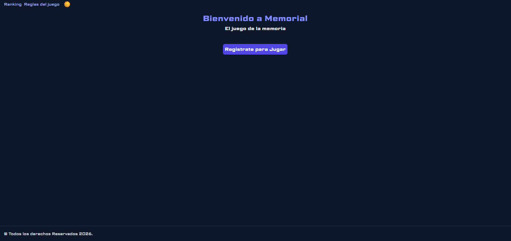
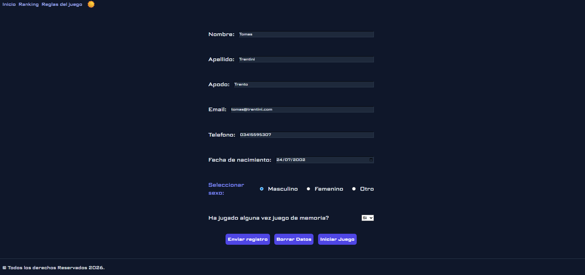
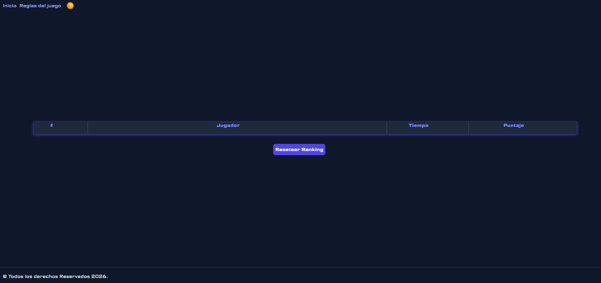
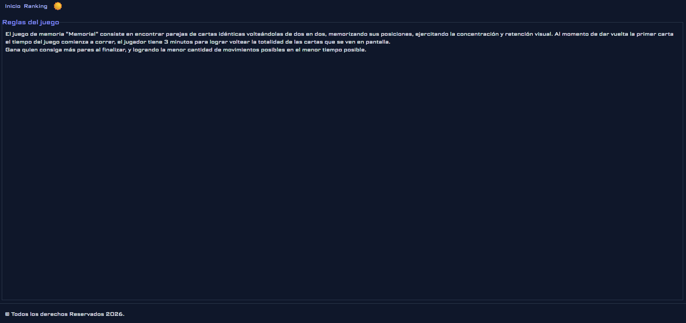
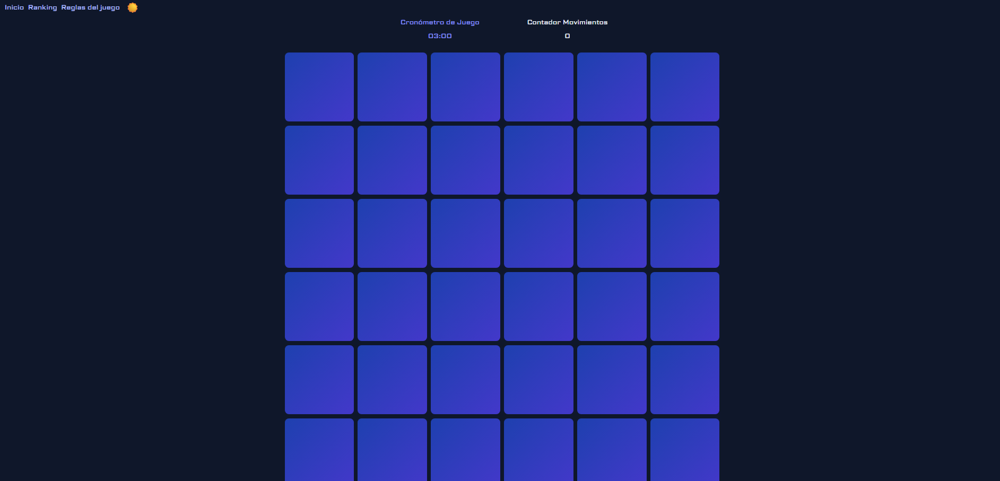

# Memorial — Juego de Memoria a Contrarreloj

Juego de memoria por pares donde la velocidad y la concentración determinan tu puntaje. Encontrá todos los pares de cartas en el menor tiempo posible, con la menor cantidad de movimientos: cuanto más rápido y eficiente, más alto llegás en el ranking.

---

## Tecnologías utilizadas

- **HTML5** — estructura y semántica
- **CSS3** — estilos, Flexbox, Grid y diseño responsive
- **JavaScript** — lógica del juego, cronómetro, puntaje y ranking
- **localStorage** — persistencia del ranking y preferencias del usuario

---

## Cómo ejecutarlo

No requiere instalación ni servidor.

1. Cloná o descargá el repositorio
2. Abrí el archivo `index.html` con doble click (o arrastralo al navegador)
3. ¡Listo para jugar!

```
tp_programacion2/
├── index.html        <- punto de entrada
├── game.html         <- juego
├── ranking.html      <- tabla de puntajes
├── rules.html        <- reglas
├── form.html         <- formulario de jugador
├── css/
│   └── styles.css
├── js/
│   ├── main.js
│   └── darkmode.js
└── images/
```

---

## Capturas de pantalla


| Inicio | Formulario |
|--------|-------|
|  |  |

| Ranking | Reglas |
|---------|-------------|
|  |  |

| Juego | 
|---------|
|   |

---

## Funcionalidades

- Tablero de cartas con emojis que se revelan al hacer click
- Cronómetro y contador de movimientos en tiempo real
- Puntaje calculado en base a tiempo y movimientos
- Ranking de los 10 mejores puntajes (persistente)
- Botón para resetear el ranking
- Modo oscuro con persistencia
- Diseño responsive (mobile y desktop)
- Formulario de registro del jugador

---

